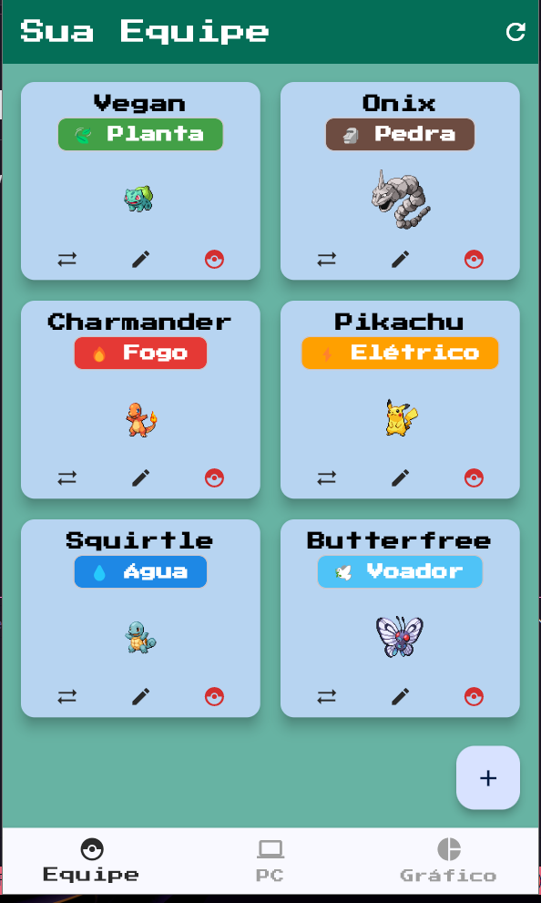
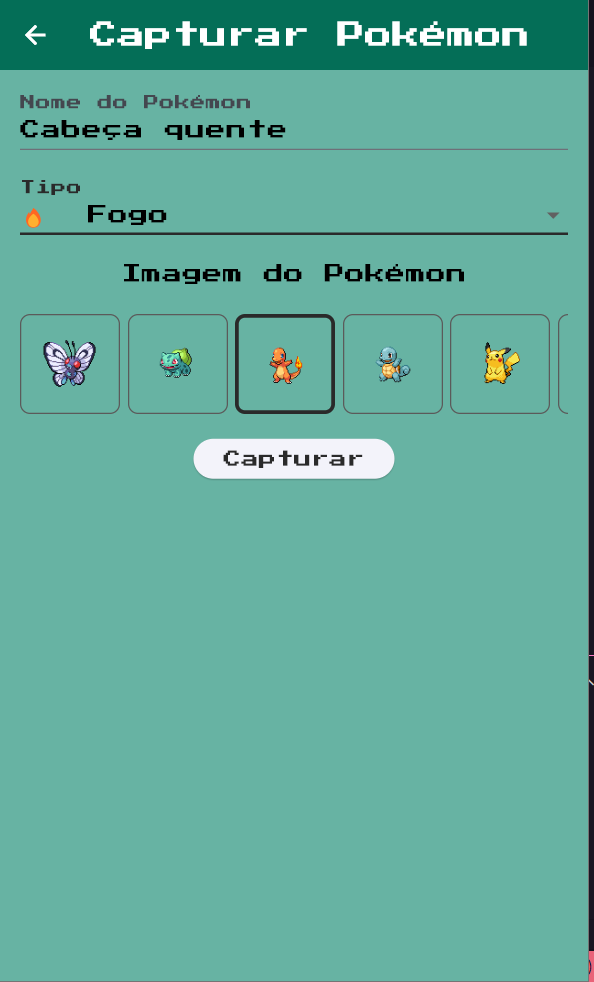
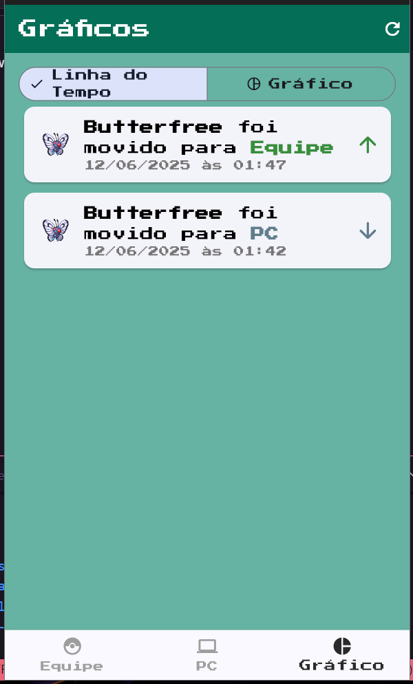
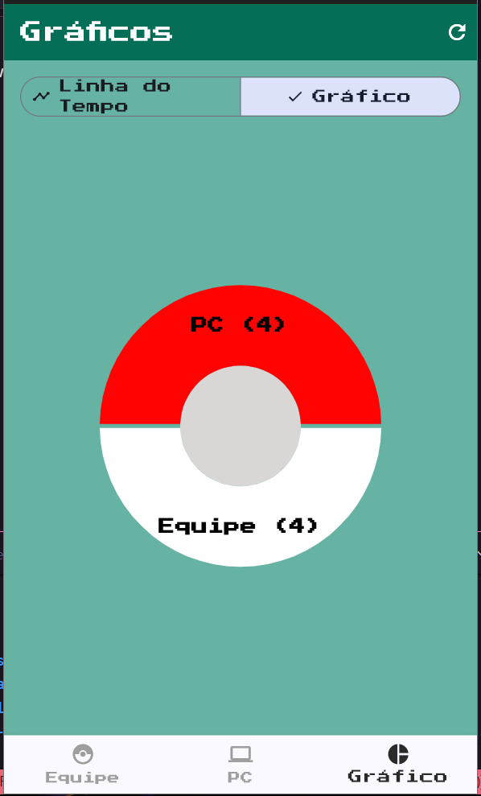

# 🐱Gerenciador de Pokémon

Aplicativo feito em Flutter para o trabalho da disciplina de Programação Mobile. O projeto simula a experiência clássica de gerenciamento de Pokémon entre equipe e PC, permitindo ao usuário capturar, organizar e visualizar sua coleção de Pokémon entre uma Equipe principal e um sistema de armazenamento (PC).

##  Funcionalidades

O aplicativo foi construído com foco em uma arquitetura robusta e em uma experiência de usuário temática e interativa.

- **Gerenciamento Completo (CRUD):** Crie (Capture), Leia (Visualize), Atualize (Renomeie) e Delete (Libere) seus Pokémon.
- **Sistema de Equipe e PC:** Organize seus Pokémon em uma **Equipe** principal (com limite de 6 membros) e um **PC** para armazenamento ilimitado.
- **Regras de Negócio:**
    - O limite da equipe é estritamente controlado.
    - Ao capturar um novo Pokémon com a equipe cheia, ele é automaticamente enviado para o PC.
    - É exibida uma mensagem de erro ao tentar mover um Pokémon do PC para uma equipe já cheia.
- **Captura Aleatória:** Ao iniciar a captura de um novo Pokémon, o formulário é preenchido com um nome, tipo e imagem aleatórios para simular um "encontro selvagem". Obs: não foram utilizadas APIs pra esse processo
- **Visualização de Dados:**
    - **Linha do Tempo:** Uma tela dedicada que mostra um histórico detalhado de todas as movimentações de Pokémon entre a Equipe e o PC, incluindo data e hora.
    - **Gráfico de Pizza:** Uma visualização alternativa que mostra a distribuição de Pokémon entre a Equipe e o PC.

##  Screenshots

<p align="center">
  
  
  
  
</p>

## 🛠️ Tecnologias Utilizadas

- **Framework:** Flutter
- **Linguagem:** Dart
- **Gerenciamento de Estado:** `flutter_bloc` (BLoC)
- **Banco de Dados:** `sqflite` com `sqflite_common_ffi` para compatibilidade com Desktop (Windows).
- **Gráficos:** `fl_chart`
- **Formatação de Data/Hora:** `intl`
- **Áudio:** `audioplayers`
- **Fontes:** `google_fonts`

##  Como Executar o Projeto

**Pré-requisitos:** Ter o [Flutter](https://docs.flutter.dev/get-started/install) instalado e configurado para desenvolvimento Desktop.

1.  **Clone o repositório:**
    ```sh
    git clone https://github.com/gabruurr/pokemon_app
    ```

2.  **Acesse a pasta do projeto:**
    ```sh
    cd pokemon_app
    ```

3.  **Instale as dependências:**
    ```sh
    flutter pub get
    ```

4.  **Execute o aplicativo:**
    ```sh
    flutter run
    ```
    O aplicativo também pode ser executado em Android.
